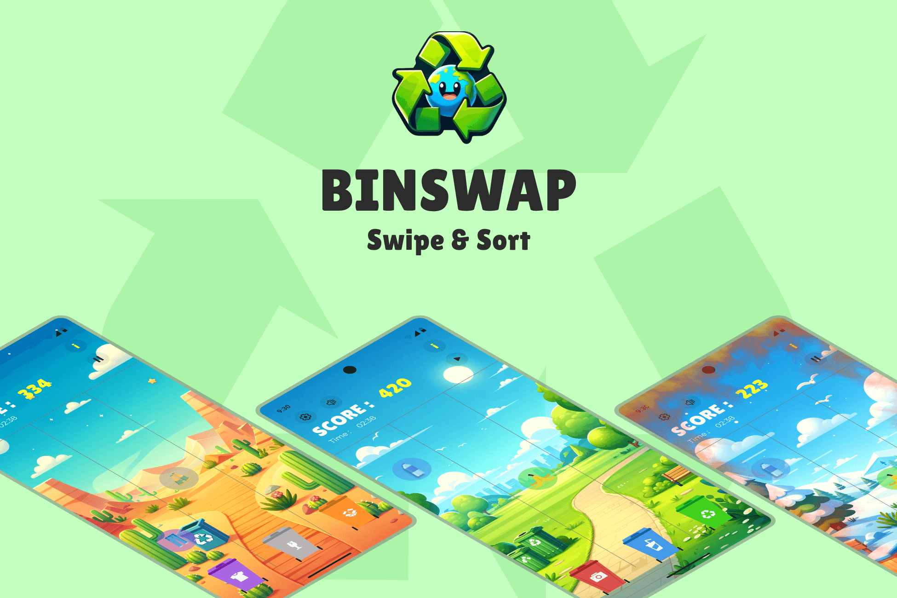
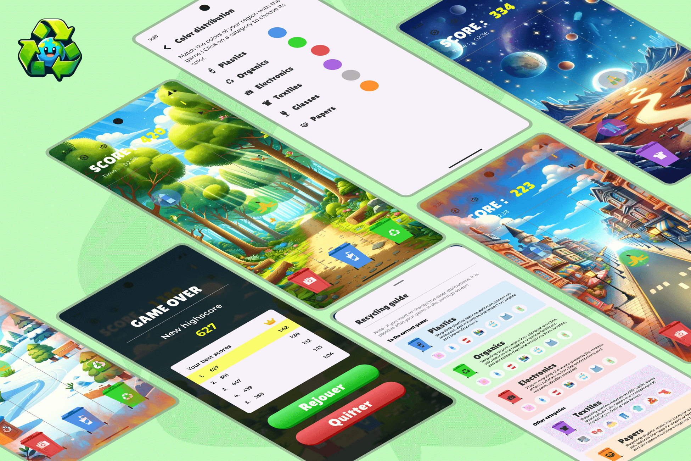

# BinSwap

♻️ Learn how to preserve the environment while beating your friends ! 🌎 Drop garbage in the right garbage cans to increase your score, and help your brain absorb waste sorting 🧠

## Installation

- Clone the GitHub repository `git clone https://github.com/ant0nit0/BinSwap.git`.
- Launch the game (in release mode for optimised results `flutter run --release`)
- Play !

## How to play ?

The goal of the game is to sort various types of garbage into the appropriate bins (Organics, Papers, Plastics, Glass, Electronics, Textiles) by swiping to change bin positions. 🗑️
Users can also drag down on a column to speed up the item. The game also includes special bonuses such as Snow, which slows down the falling items, and Multi (x2), which doubles the score temporarily. Players earn "coins", that they can use to buy custom backgrounds and more in the future. ✨

## Features

- Multi-lingual support (English and French) 🤝
- Customizable bin colours to match real-life recycling standards 🟢
- Special bonuses like Snow and Multi (x2) to enhance gameplay 🪄
- In-game currency system for purchasing custom backgrounds and future content 🏤

## Dependencies

- [audioplayers](https://pub.dev/packages/audioplayers) - ^1.1.1
- [confetti](https://pub.dev/packages/confetti) - ^0.7.0
- [concentric_transition](https://pub.dev/packages/concentric_transition) - ^1.0.3
- [cupertino_icons](https://pub.dev/packages/cupertino_icons) - ^1.0.2
- [flame](https://pub.dev/packages/flame) - ^1.14.0
- [flutter_hooks](https://pub.dev/packages/flutter_hooks) - ^0.20.3
- [flutter_launcher_icons](https://pub.dev/packages/flutter_launcher_icons) - ^0.13.1
- [flutter_riverpod](https://pub.dev/packages/flutter_riverpod) - ^2.3.6
- [flutter_svg](https://pub.dev/packages/flutter_svg) - ^2.0.5
- [flutter_translate](https://pub.dev/packages/flutter_translate) - ^4.0.4
- [flutter_secure_storage](https://pub.dev/packages/flutter_secure_storage) - ^9.0.0
- [freezed_annotation](https://pub.dev/packages/freezed_annotation) - ^2.2.0
- [hooks_riverpod](https://pub.dev/packages/hooks_riverpod) - ^2.3.6
- [intl](https://pub.dev/packages/intl) - ^0.18.1
- [json_annotation](https://pub.dev/packages/json_annotation) - ^4.8.1
- [riverpod](https://pub.dev/packages/riverpod) - ^2.3.6
- [riverpod_annotation](https://pub.dev/packages/riverpod_annotation) - ^2.1.1
- [smooth_page_indicator](https://pub.dev/packages/smooth_page_indicator) - ^1.1.0

